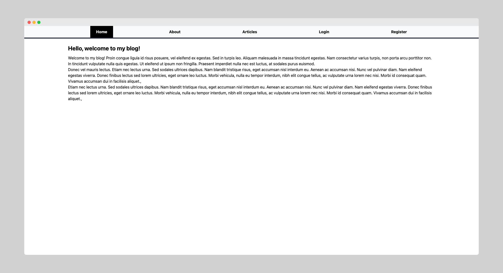
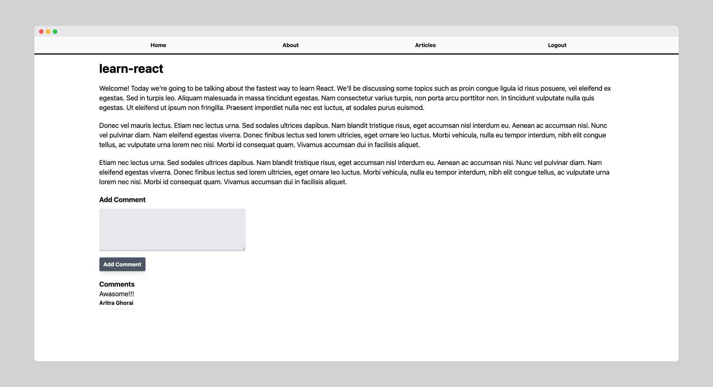

# Blog application with React.js, Node.js

## What technologies are we using?

### Node.js

- ReactJS
- Firebase Auth
- ExpressJS

### React.js

- React hooks
- Context API
- TypeScript

## What will you learn?

- How to manage auth using firebase
- How to connect mongodb with express
- How to organize code for maintainability

## Structure

1. Bootstrap backend
2. Bootstrap frontend
3. Setup sockets on the backend
4. Setup sockets in React with context API
5. Add set username functionality
6. Add create room functionality
7. Add send message functionality
8. Styling

## Screenshots

